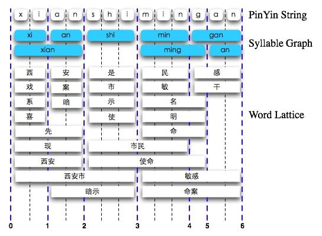
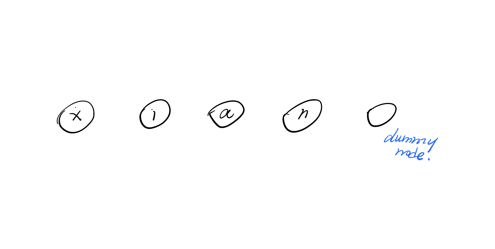
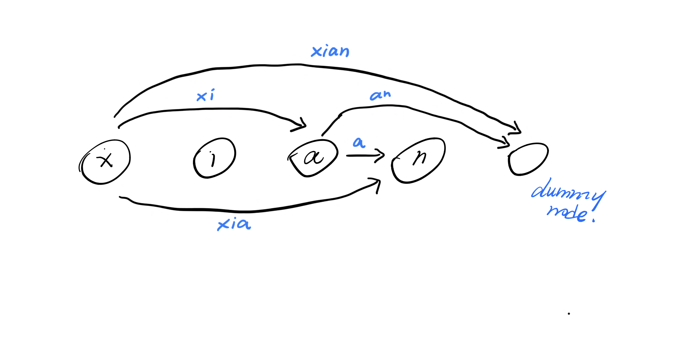
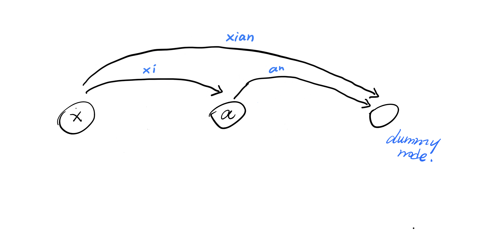
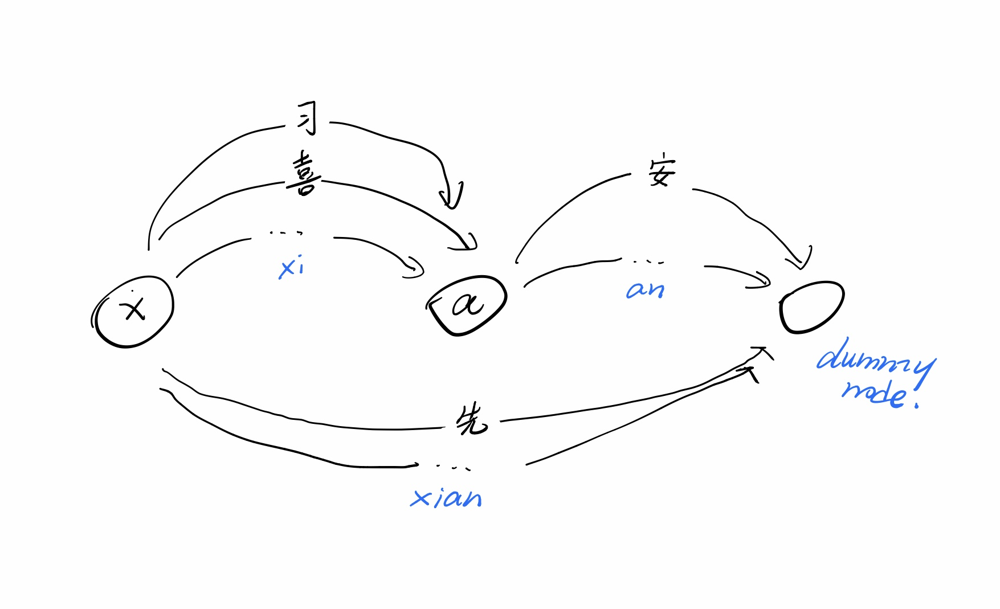
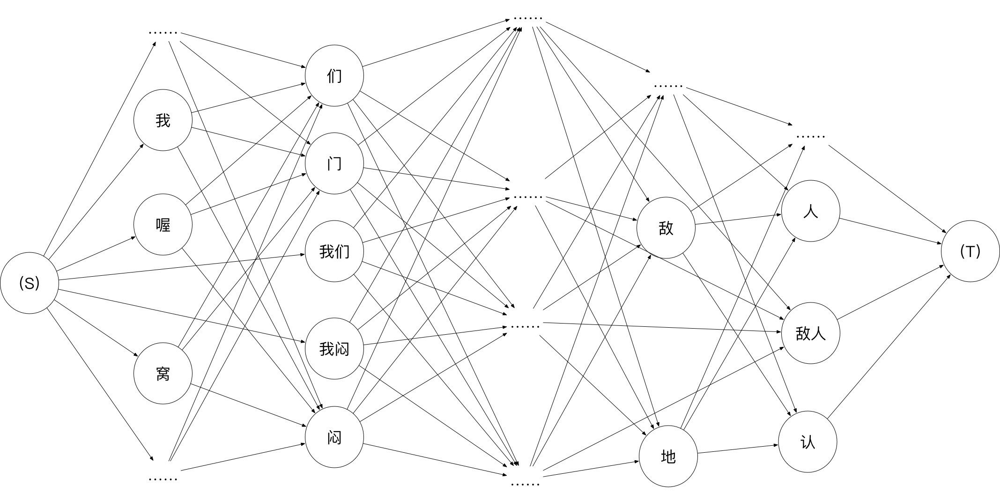

## Introduction

Chinese has over 50,000 characters in total and an educated Chinese speaker will know about 8,000 characters. That is still a huge number compared to the 26 character alphabet of English. When it comes to input your language into the computer, English users can type using a regular keyboard with 26 alphabetic characters on it. However, have you ever wondering the way Chinese input their language into the Computer? 


Fortunately, most Chinese people nowadays use a system called [Pinyin](https://en.wikipedia.org/wiki/Pinyin) that enables them to use a standard keyboard to input Chinese into the computer system. Pinyin is a romanization of the Chinese character based on their pronunciation.  Since many characters have the same pronunciation in Chinese, one Pinyin syllable can correspond to multiple Chinese characters. For example, the Chinese Pinyin sequence *li'chang* can be translated to *立场*, which means position, or *力场*, which means forced field, dependents on the tones of each Pinyin and its context. 

Therefore, it is necessary to design a system that efficiently lists all possible Chinese characters string given a Pinyin sequence. The system must be efficient enough to present the potential Chinese characters to the user in real-time such that user can not sense any delay in their input process. Also, the potential Chinese characters should be listed in order of their frequency, or in other words, the possibility of this sentence. For example, for Pinyin sequence *ni'xi'huam'ma*, *你喜欢吗*, which means *Do you like it*, is a more likely option compared to *你西湖吗*, which means *Do you like Xi'hu*. To implement such system, people use a mathematical model called Statistical Language Model to  compute the probability distribution over a sequence of words because brute-forced search is computationally impossible. 

## Statistical Language Model

In short, the statistical language model (SLM) is a model to calculate the possibility over a sequence of words based on the statistic from the real text samples. For a word sequence $S$ with $n$ characters, we use $w_1...w_n$ to represent each individual character. Then, the possibility of Sequence $S$ appears in the text can be represented by
$$
P(S) = P(w_1, w_2,w_3,...,w_n)
$$
By expanding $P(w_1, w_2,w_3,...,w_n)$, we get
$$
P(w_1, w_2,w_3,...,w_n) = P(w_1)P(w_2|w_1)P(w_3|w_1,w_2)...P(w_n|w_1,w_2,...,w_{n-1})
$$
where $P(w_1)$ represent the possibility of word/character $w_1$ shows up in the text and $P(w_2|w_1)$ represents the possibility of $w_2$ shows up in the text given $w_1$ precedes $w_2$. 

Notice that probabilities are obtained by conducting statistical analysis on sufficiently large text. However, there is an important problem to solve: data sparsity. In many times, the sequence $w_1, w_2, w_3,...,w_n$ may not observable in text data before, making it impossible to obtain the probability $P(w_n|w_1,w_2,...,w_{n-1})$. To bypass this problem, we often assume our word sequence has [Markov property](https://en.wikipedia.org/wiki/Markov_property). That is, we assume the probability of a word $w_i$ in word sequence $S$ is only decided by a limited amount of word precedes it. 
$$
\text{Assume } P(w_n|w_1,w_2,...,w_{n-1}) = P(w_n|w_{n-1})
$$
If you have some knowledge on [Markov chain](https://en.wikipedia.org/wiki/Markov_chain), you will realize the above probability can be re-written into
$$
P(w_1, w_2,w_3,...,w_n) = P(w_1)P(w_2|w_1)P(w_3|w_2)...P(w_n|w_{n-1})
$$
This is similar to the first-order Markov chain, where the probability of $w_t$ only depends on $w_{t-1}$. In natural language processing, we have a special name for this, [N-gram model](https://en.wikipedia.org/wiki/N-gram), where $N$ represents the number of words we used to calculate the probability. In the case above, we use two words to calculate the probability of each word in $S$ and we therefore call it a bi-gram model. In practice, the bi-gram model is the most common model because it balances the accuracy of prediction and the amount of data to store. 

## Algorithm Overview

In general, our algorithm takes a Pinyin string as input and output a list of Chinese sentences where sentences are sorted in terms of their probability. The Pinyin string will first be transformed into a syllable graph. Then, a list of valid Pinyin sequences can be generated using the syllable graph. Using the Pinyin sequences, a lexicon graph can be generated and this is where we transform Pinyin into Chinese characters. After that, we will use our knowledge from the statistical language model to build a SLM Graph that joins lexicon together to form a sentence in Chinese.



To prevent confusion, I made a table to explain all the jargon above.

|                 |                          Definition                          |          Example          |
| :-------------: | :----------------------------------------------------------: | :-----------------------: |
|    Syllable     |                 the smallest unit of Pinyin                  | *ni*, *hao*, *pin*, *yin* |
| Pinyin Sequence |                    a sequence of syllable                    |    *ni'hao*, *pin'yin*    |
| Lexicon/Lattice | the smallest unit of meaningful Chinese (it could be both single or multiple Chinese characters) |        你好, 拼音         |
|    Sentence     |                    a sequence of lexicon                     |         你好拼音          |


## Syllable Graph

In this part, we will discuss how do we use the syllable graph to convert raw Pinyin string that from users into valid Pinyin sequences.

You may notice that for all Pinyin sequence above, I use ``'`` to separate each syllable from each other. However, when users input the Pinyin string, they are not kind enough to use ```'``` to separate them apart. Therefore, we need to build a syllable graph to generate valid syllable sequences from raw Pinyin input.

Let's start with an example, for raw Pinyin string *xian*, we can build a syllable graph where each vertex represent a character. Notice that we also add a dummy vertex at the end.



Then, for a Pinyin raw string $S$ , we add an edge incident to vertex $i$ and vertex $j$ if and only $S[i:j-1]$ is a Pinyin syllable. For example, we will add an edge to connect *x* and *a* because *xi* is a valid Pinyin syllable. 



After adding all the edge, you will realize that not all Pinyin syllable is part of a valid Pinyin sequence. For example, *xi'an* is a valid Pinyin sequence while *xia'n* is not because *n* is not a valid syllable. From the graph perspective, we observe that a Pinyin sequence is a valid Pinyin sequence if and only if there exists a path from the first (left-most) vertex to the last dummy vertex. Then, *xi'an* and *xian* are valid Pinyin sequence but *xia'n* and *xi'a'n* are not. 

For the sake of simplicity and to avoid unnecessary memory usage, we can "shrink" the graph by removing unused vertices and edges from the graph.



In this example, we removed vertex *i* and vertex *n* since they never appear on any path from the first vertex to the last dummy vertex. And the two edges were for the same reason.

Now, we have our final syllable graph which will be passed to the next step to form a  lexicon graph. Also, we managed to obtain two valid Pinyin sequences *xi'an* and *xian* from the raw Pinyin input *xian*. 

## Lexicon Graph

Based on the syllable graph, we can construct a lexicon graph that each edge represents a Chinese lexicon. We will need a procedure that translates Pinyin syllable to all possible Chinese lexicon. Such procedure can be implemented using an R-trie or even a database. However, we will skip the detail implementation here since this procedure is not the main focus of this post.



In the lexicon graph, we substitute edge from syllable graph to lexicon. For example, syllable *xi* can be translated into *系, 西, 洗, 喜* and many more Chinese lexicons. For each possible translation of syllable, we add an edge that incidents to the same vertices of the syllable edge and store this Chinese lexicon in the edge.

## SLM Graph

Having a lexicon graph that each edge represents a Chinese lexicon, we can form a Chinese sentence by joining a sequence of edges in a path from the first vertex to the last dummy node. By exhausting all possible paths from the first vertex to the last dummy vertex, we can generate all possible Chinese sentences from the raw Pinyin string given by the user. But we also want to get the probability of each sentence in the process so that we can present Chinese sentences to the user in the order of sentences' probability. 

To calculate the probability of each sentence, we first construct a line graph of lexicon graph. Recall that $L(G)$ of a graph $G$ is obtained by creating a vertex per edge in $G$ and connect two vertex in $L(G)$ if and only if such two edges is incident to the same vertex in $G$. We also add a start vertex $(S)$ and end vertex $(T)$ to denote the start and the end of the SLM Graph.



After the transformation, we obtain a graph above, where each vertex in the graph is a lexicon. Then, we should add weight to each directed edge in our SLM graph such that a directed edge from vertex $i$ to vertex $j$ has a weight $P(i|j)$ from our statistic learning model.

We can now calculate the probability of a sentence by the $\prod_{}^{e_{i} \in P} e_{i}$ where $P$ is a path from $(S)$ to $(T)$. In addition to that, since our SLM graph is a directed acyclic graph, we can calculate the top-K shortest path using a dynamic programming algorithm. 

One trivial detail is that since each transition probability $P(i|j)$ is relatively small, the product of them may be too small for us to keep track of, resulting in the "vanish" of probability. To solve this problem, we can log transform the probability 
$$
P(w_1, w_2,w_3,...,w_n) = P(w_1)P(w_2|w_1)P(w_3|w_1,w_2)...P(w_n|w_1,w_2,...,w_{n-1}) \\
\log{P(w_1, w_2,w_3,...,w_n)} = \log{P(w_1)} + \log{P(w_2|w_1)} + \log{P(w_3|w_2)} + ... + \log{P(w_n|w_{n-1})}
$$
so that the probability can now be calculated by $\sum_{}^{}\log{e_i}$.

## Conclusion

Now we cover rough steps of my graph-based Pinyin inference algorithm. Users can give the algorithm a valid raw Pinyin and the algorithm can return the Top-K Chinese sentence by their probability. However, there is still room for improvement. For example, we can add a mechanism to check the validity of the user's input. Also, we can speed up the algorithm by adding a cache to store bi-gram query result so that we can re-use them next time. 

Due to the time limitation, I was not able to cover all the aspects of this algorithm. You can check my [implementation](https://github.com/Olament/Hanzi2PinyinEngine) in Swift for more details.

## Acknowledge

Thanks to Mr. Guo Jiabao for open sourcing his [implementation](https://www.byvoid.com/zht/blog/slm_based_pinyin_ime) of SLM-based Pinyin inference algorithm. My algorithm would not be possible without this.

